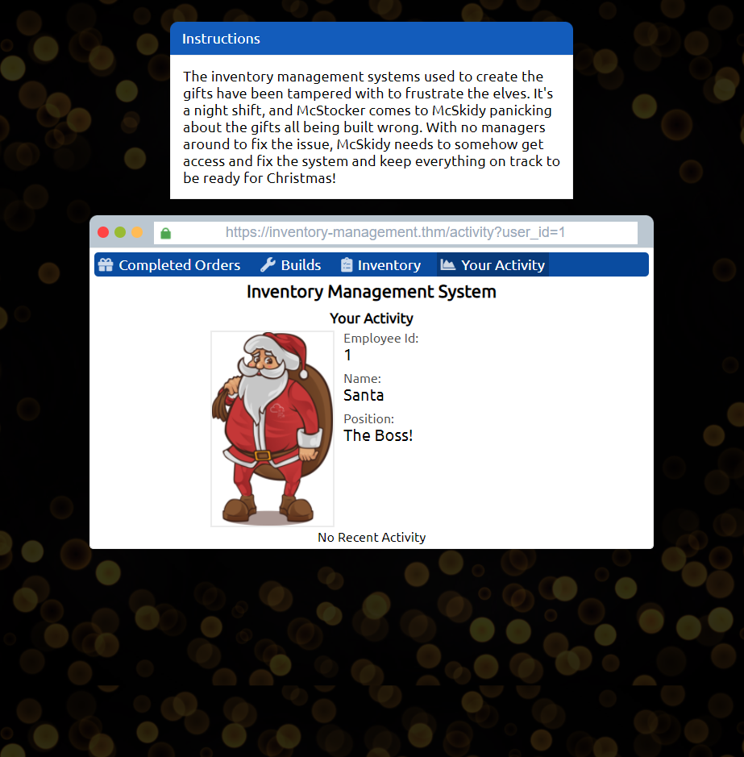
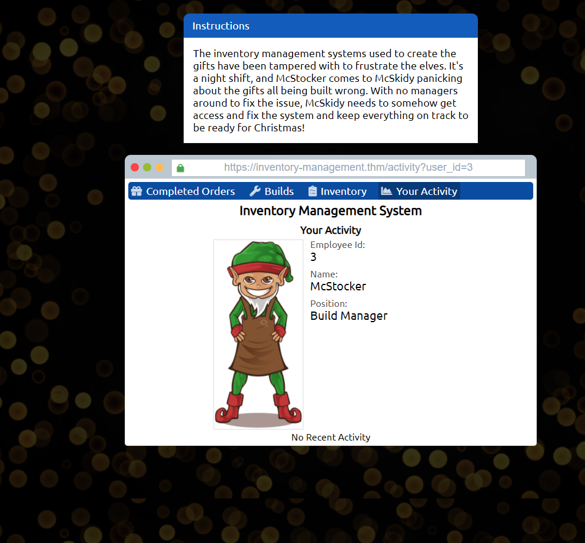
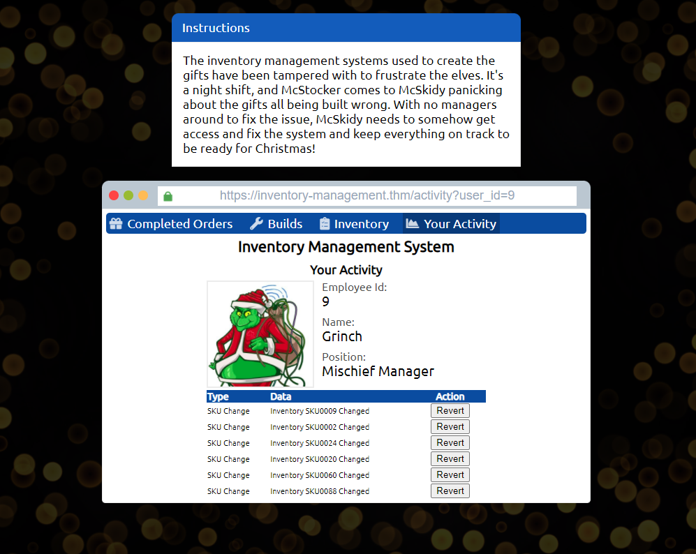
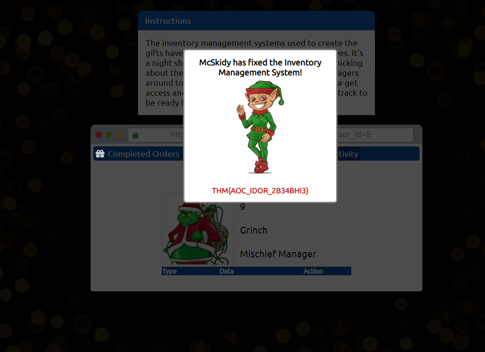

1. After finding Santa's account, what is their position in the company?
When "Your Activity" tab is clicked, it displays default user_id=11. When trying to change the user_id from 1 to 20, Iget all information about Santa, whose user_id=1

-> Answer: The Boss!

----------

2. After finding McStocker's account, what is their position int he 
company?
Continue trying user_id from 1 to 20, I get McStocker's account, whose user_id=3

-> Answer: Build Manager

----------

3. After finding the account responsible for tampering, what is their position in the company?
Similarly, I get the user_id=9

-> Answer: Mischief Manager

----------

4. What is the received flag when McSkidy fixes the Invetory Management System?
On the Grinch activity page, I notice that there are "Revert" buttons. After reverting everything, I get the flag.

-> Answer: THM{AOC_IDOR_2B34BHI3}

[Day 2](../"Day%2008%20-%20Special%20by%20John%20Hammond%20-%20Santa's%20bag%20of%20toys"/index.md)
