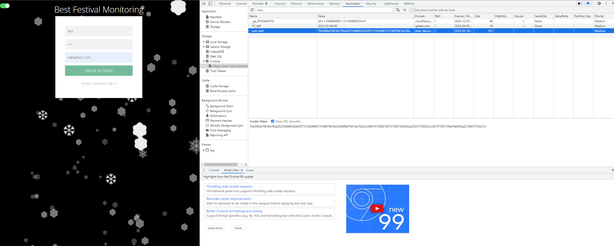
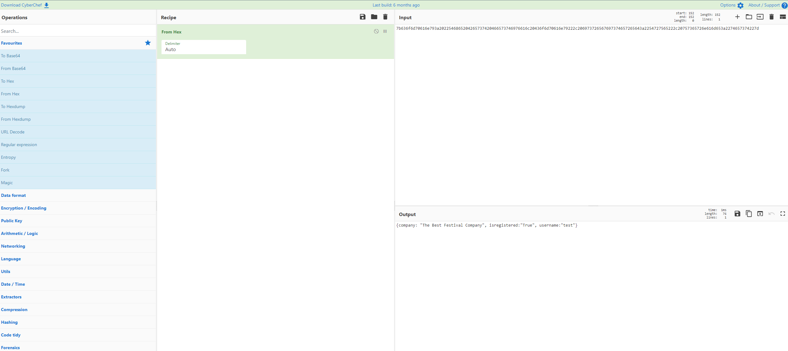
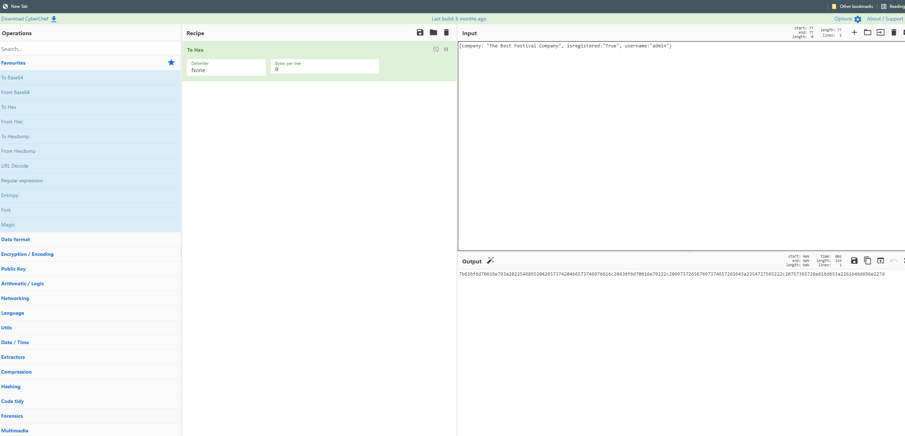
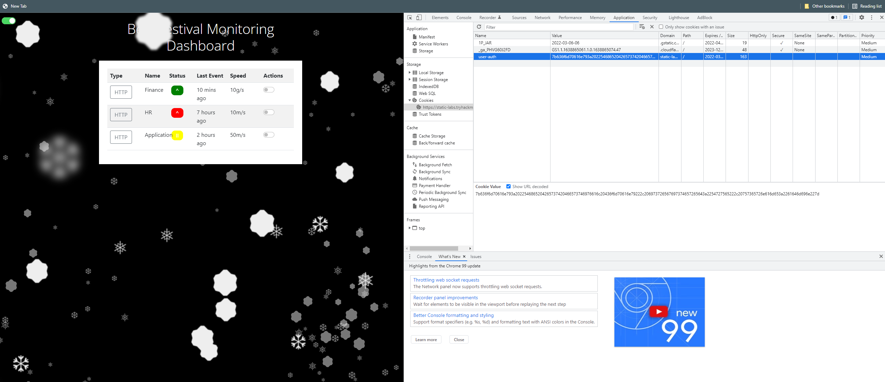

1. What is the name of the new cookie that was created for your account?
After an attempt to sign up for a new account, I inspect the page on the Applicaiton tab to see the cookie.

** Stepsto perform **
 * Right click the page and Click "Inspect"
 * Select the "Application" tab
 * On the left side, under the menu, expand the "Cookies" option
 * Here you can view all information about the cookies.

-> Answer: user-auth 

----------------------------

2. What encoding type was used for the cookie value?

-> Answer: hexadecimal

-----------------------------

3. What object format is the data of the cookie stored in?
I can use [CyberChef](https://gchq.github.io/CyberChef/) to decode the cookies.
**Step to perform **
 * Go to CyberChef
 * On the left menu, select "From Hex" option
 * Paste the cookie's value into the "Input" field.
 * Click "Bake" button
 * The decoded message will be displayed.

-> Answer: JSON

------------------------------

4. What is the value of the administrator cookie? (username = admin)
Using the same tool CyberChef, i can get the cookie value of username = admin

** Step to perform **
 * Go to CyberChef
 * On the left menu, select "To Hex" option
 * Paste the JSON value decoded in question 3 into the "Input" field
 * Set the username to admin ("username":"admin")
 * Make sure the delimeter field is set to "NONE"
 * Click "Bake" button
 * We get the cookie value of the admin

-> Answer: 7b636f6d70616e793a2022546865204265737420466573746976616c20436f6d70616e79222c206973726567697374657265643a2254727565222c20757365726e616d653a2261646d696e227d

--------------------------------

5. What team environment is not responding?
After getting the cookie value of admin, I can use that to bypass the login authenticaion.

** Steps to perform**
 * Follow the steps in question 1 to get to the user-auth cookie
 * Replace the current cookie value with the admin's cookie value
 * Refresh the page
 * I am now logged in. 

-> Answer: HR

-----------------------------

6. What team environment has networking warning?
Refer to the image above, we can see the anser is Application.

-> Answer: Application

[<< Day 01](../Day%2001%20-%20Save%20the%20gifts/index.md) | [Day 03 >>](../Day%2003%20-%20Christmas%20Blackout/index.md)
