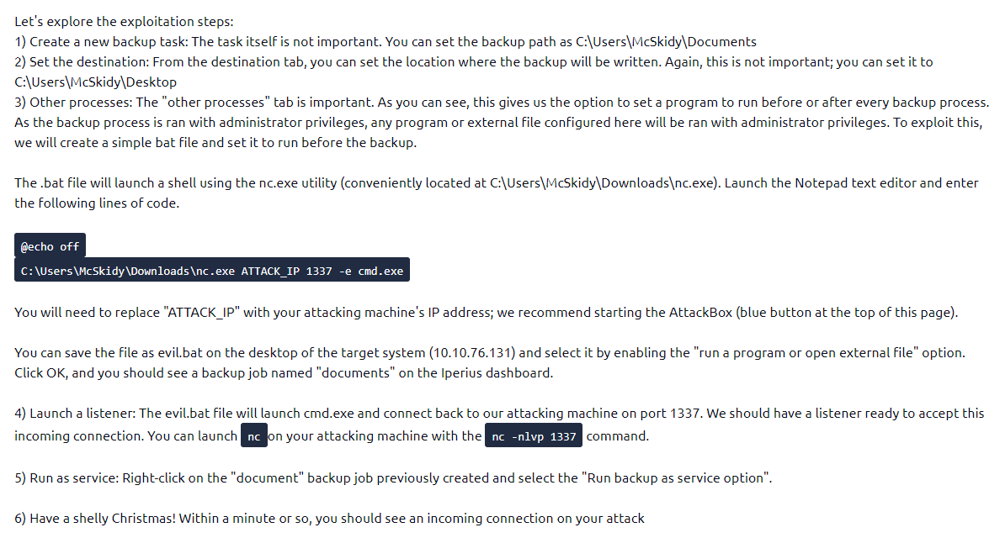

**Optional:** I use remote access to the desktop using the followin command
xfreerdp /u:mcskidy /p:Password1 /v:<Target_IP>

1. Complete the username: p.....
Once connect to the desktop, I run net users to see the list of users on the machine:

> net users

From here we see, the list of users on the machine, inlcuding the one starting with p
-> Answer: pepper

----------------------------------------
2. What is the OS version?
Running the following command will yield the OS version of the machine:

> systeminfo | findstr "OS"

-> Answer:  10.0.17763 N/A Build 17763

-------------------------------
3. What backup service did you find running on the system?
Since I know the machine uses Iperius Backup serivce, running the following command will yiled all information about the backup service:

> wmic service list | findstr "Iperius"

-> Answer: Iperiussvc

----------------------------------------------------------
5. What is the path of the executable for the backup service you have identified?
The above command also gives the path of the exe file.

-> Answer: C:\Program Files (x86)\Iperius Backup\IperiusService.exe

Follow the instructions provided to create a reverse shell:

![[exploit_instructions.png]]

6. Run the whoami command on the connection you have received on your attacking machine. What user do you have?

-> Answer: the-grinch-hack\thegrinch

---------------------------------------
7. What is the content of the flag.txt file?
Navigate to thegrinch's Documents folder, you'll see the flag.txt file. Use "type" command to read its content.

> type flag.txt

-> Answer: THM-736635221

--------------------------------------
8. The Grinch forgot to delete a file where he kept notes about his schedule! Where can we find him at 5:30?
Similarly, on the same directory, you'll find schedule.txt. Use the "type" command to read its content

> type schedule.txt

-> Answer: jazzercise

### What I've achieved from this room?
* Different levels of users accounts in Windows
* Revisit command to rdp a desktop
* Commands for Windows reconnaissance: 

	> net users - enumerate users
	>systeminfo | findstr "OS" - enumerate OS information
	>wmic service list - enumverate services running on Windows
	>wmic service list | findstr "Iperius" - find a specific service running on Windows
	
				
		
