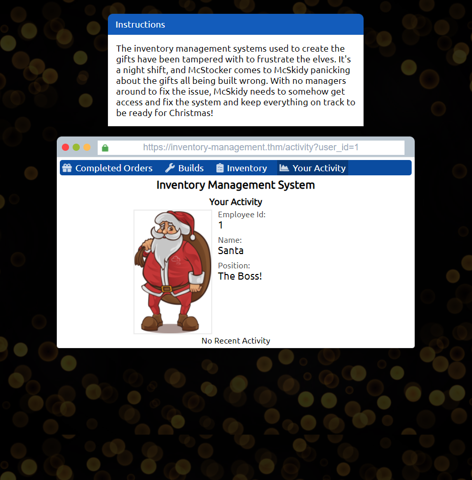
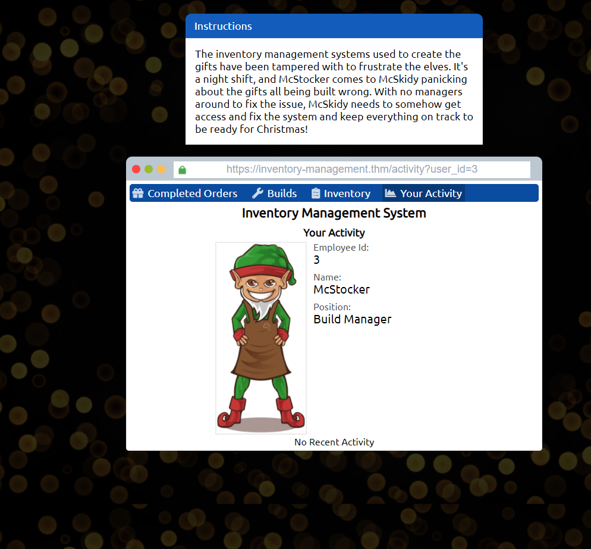
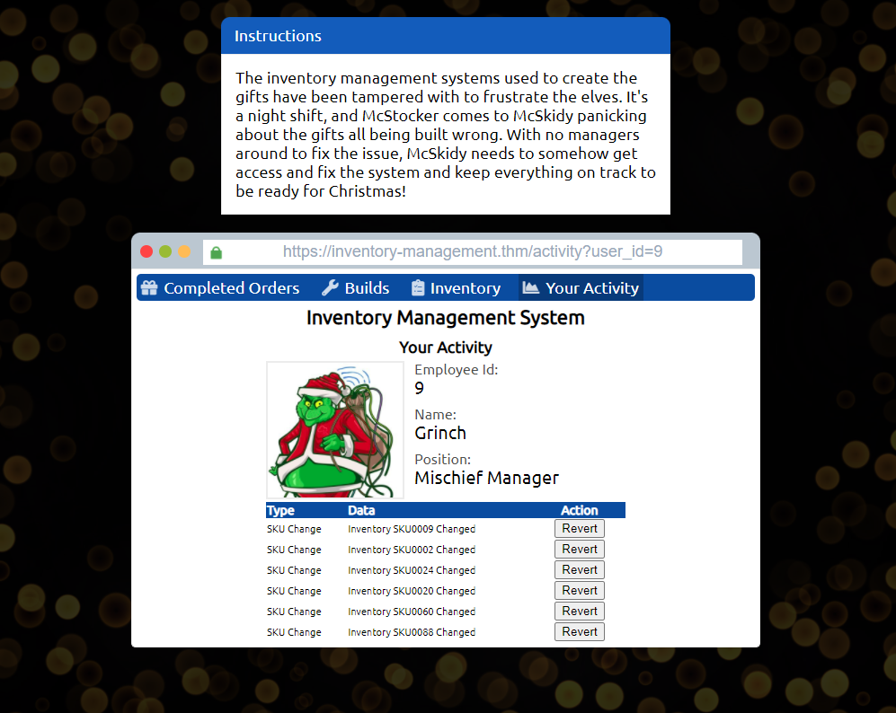
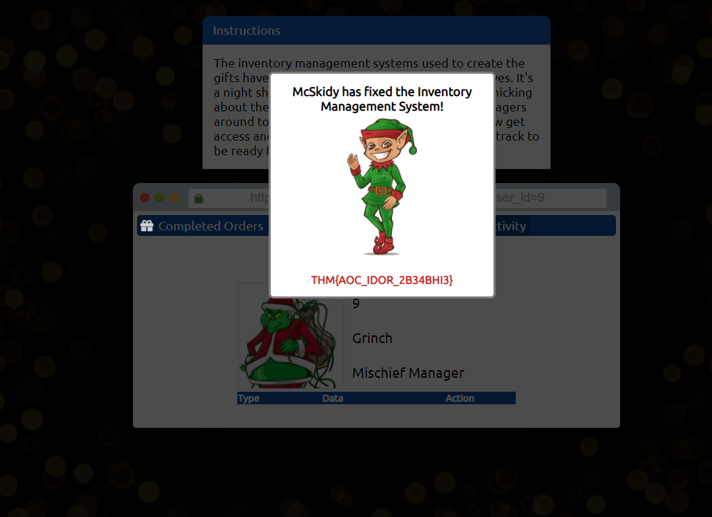

 ## [Day 01] - Save the gifts!

### Objectives
Learn about IDOR vulnerability, how to find and exploit IDOR vulnerabilities.

### [Resources](https://tryhackme.com/room/adventofcyber3)

### Walkthrough
1. After finding Santa's account, what is their position in the company?
When "Your Activity" tab is clicked, it displays default user_id=11. When trying to change the user_id from 1 to 20, Iget all information about Santa, whose user_id=1

  
Answer

  The Boss!

----------

2. After finding McStocker's account, what is their position int he 
company?
Continue trying user_id from 1 to 20, I get McStocker's account, whose user_id=3

  
Answer

  Build Manager

----------

3. After finding the account responsible for tampering, what is their position in the company?
Similarly, I get the user_id=9

  
Answer

  Build Manager
  Mischief Manager

----------

4. What is the received flag when McSkidy fixes the Invetory Management System?
On the Grinch activity page, I notice that there are "Revert" buttons. After reverting everything, I get the flag.

  
Answer

  Build Manager
  THM{AOC_IDOR_2B34BHI3}

[Day 02 >>](../Day%2002%20-%20Elf%20HR%20Problems/README.md)
