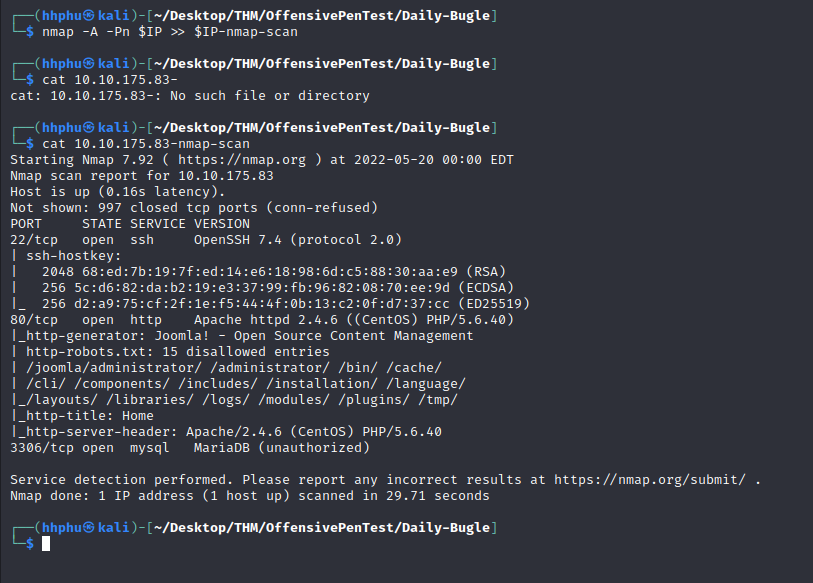
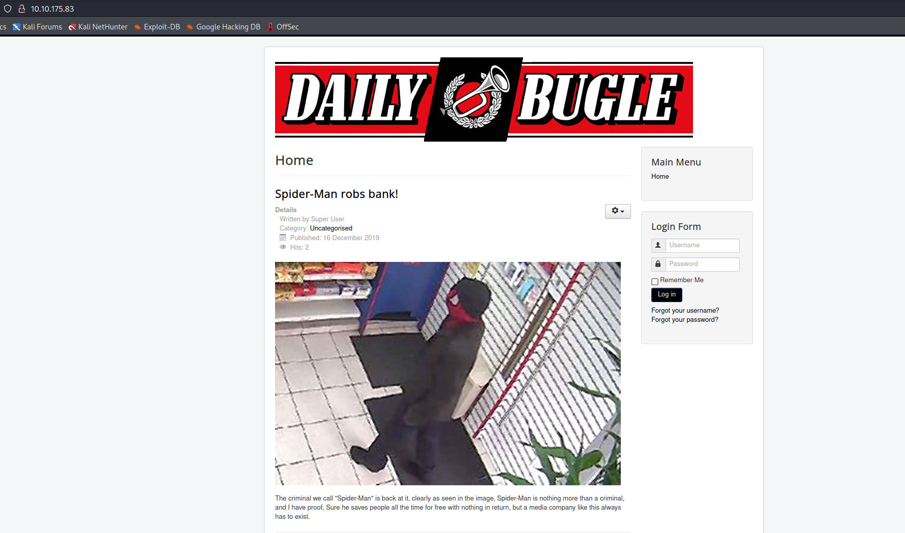
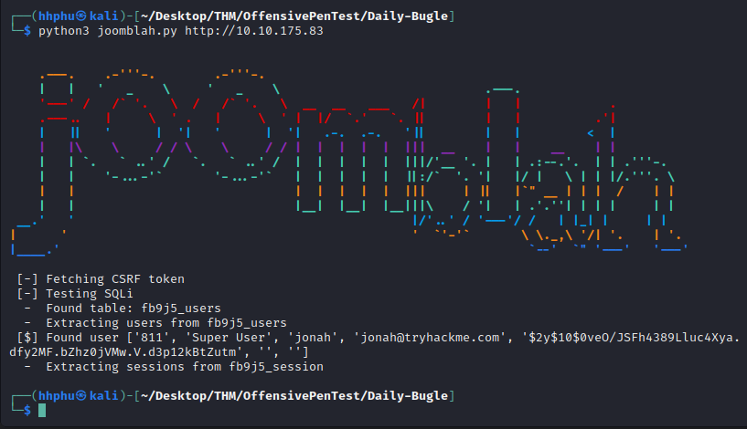
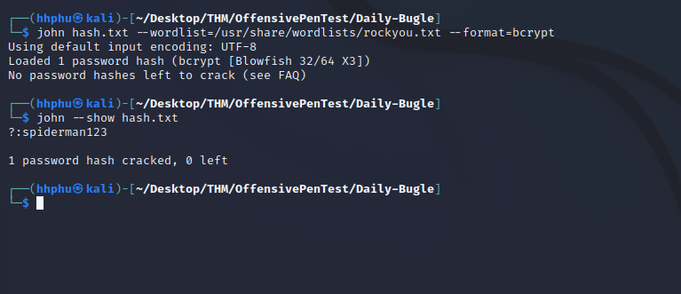
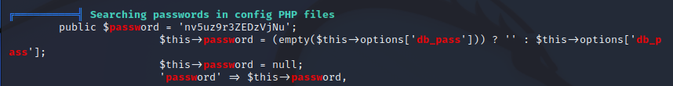
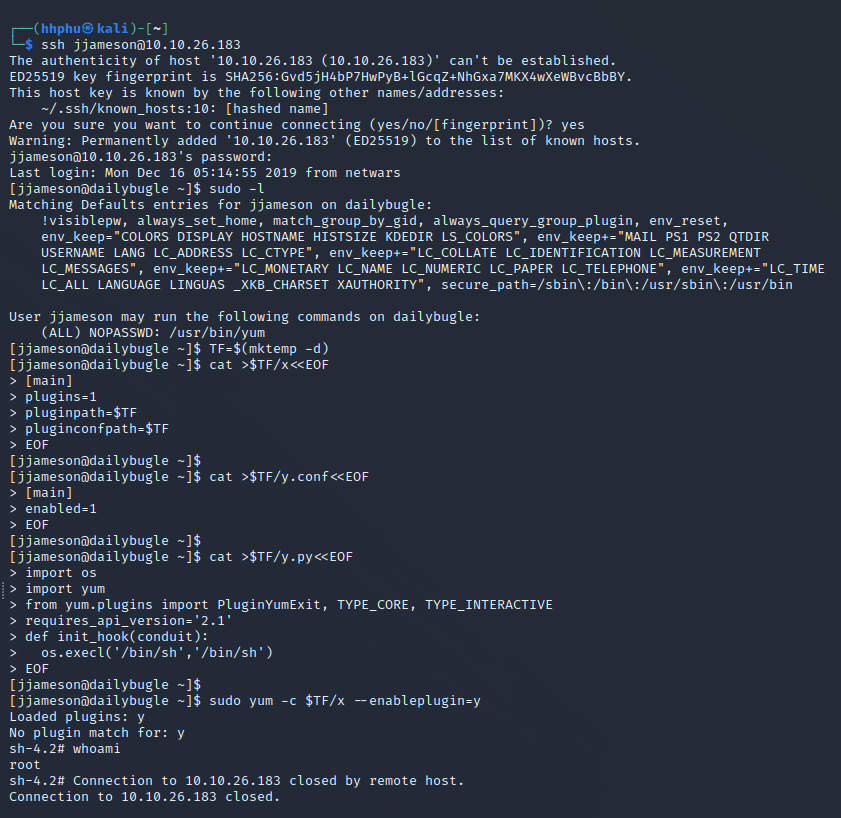

------
- **Title:** Daily Bugle
- **Description**: Compormise a Joomla CMS account via SQLi, practice cracking hashses and escalate your privileges by taking advantage of yum.
- **IP Address:** 10.10.175.83
- **Set up:**
```bash
	### Set $IP variable to the assigned IP Address
	export IP=10.10.175.83
```
------


# Reconnaissance
```bash
	### Run nmap to gather the target's information
	nmap -A -Pn $IP >> $IP-nmap-scan
```



From the nmap scan, I see port 80 is open:



Also from the nmap result, I found some potential directories to exploit and figured that the web server is using Joomla.

Doing some Googling, I found a way to find Joomla version by accessing the following url:
_https://www.itoctopus.com/how-to-quickly-know-the-version-of-any-joomla-website_

Also from this link, I was able to find a lot of directories for possible exploits. Joomla version can also be found in README.md


# Exploit
I found a vulnerability related to Joomla 3.7.0 [CVE-2017-8917]("https://www.exploit-db.com/exploits/42033")
Using a python script from [HarryR's github]("https://github.com/XiphosResearch/exploits/tree/master/Joomblah"), I was able to retrived the login credentials for the CMS.

```bash
	python3 joomlah.py http://$IP
```



Found a user "jonah" with a hash password, which uses bcrypt algorithm. Use John to crack this hash:

```bash
	john hash.txt --wordlist=/usr/share/wordlists/rockyou.txt --format=bcrypt
```



We're now able to log into Joomla admin as jonah

Following instruction on this [article]("https://www.hqphu.com/posts/6H6RATKcCXxBmtS027AfKO"), I was able to gain a reverse shell on the machine. Running linpeas.sh on the target machine, I found a password in config file:



Using this password, we're able to SSH to the target machine under jjameson.
A simple command ```sudo -l```, we found jjameson can run yum. Refering to [GTFOBins]("https://gtfobins.github.io/gtfobins/yum/"), i was able to escalate to root.



--------
<details><summary>Answer</summary>
<br>
1. What is the Joomla version? => 3.7.0 <br>
2. What is the Joomla version? => spiderman123 <br>
3. What is the Joomla version? => 27a260fe3cba712cfdedb1c86d80442e <br>
4. What is the Joomla version? => eec3d53292b1821868266858d7fa6f79 <br>
</details>

